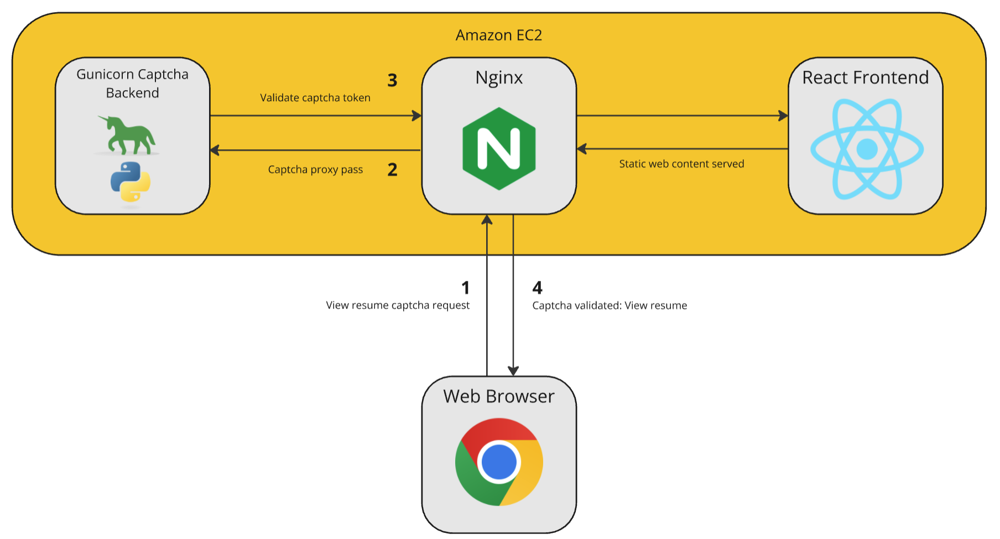

# Lug Personal Website
Node.js
npm install --legacy-peer-deps

# Updating SSL Cert
Documentation
https://certbot.eff.org/instructions?ws=nginx&os=pip

# Resume ReCaptcha
I don't want bots gathering my resume personal information and spamming me.

I added silent reCaptcha v3 authentication before the resume is displayed.

This required me to create a backend. I chose python because it was already installed on my tiny EC2 instance,
and I do not want to install anything else on my free tier t2.micro server.

Here's a diagram showing what I did. You want documentation on how to do it yourself? Read the code.

